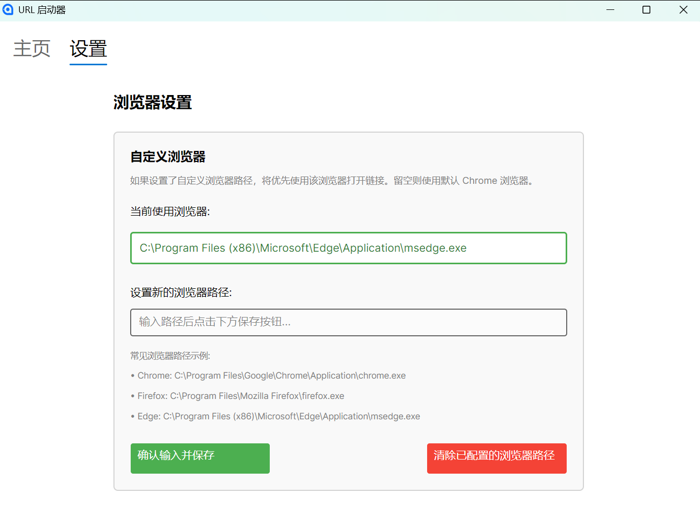

# UrlLauncher

This is a project developed based on the dotnet avalonia template for managing personal information sources. The goal is to avoid opening social media and scrolling aimlessly. This project ensures that I get information from the internet without getting lost in it.

## Basic Usage

Here is an introduction to the basic usage.

I have only built the x64 version for Windows. After downloading, unzip it to get a folder containing various dotnet dependencies. Running `UrlLauncher.exe` will open a pop-up window.

### Set Browser Path

If this is not set, the program will try to run `chrome https://...` to open webpages. This should generally work if you have Chrome installed.

If it doesn't work or you want to use a different browser, you need to set the browser path. Common browser installation paths are also listed below. Here, I'll use Edge as an example:

Click "设置" enter `C:\Program Files (x86)\Microsoft\Edge\Application\msedge.exe` into the input box, and then click "Confirm Input and Save" below. You will see that the currently used browser has changed. Clicking "Clear Configured Browser Path" will revert to the default, which attempts to use Chrome. If you need to change it, you can of course re-enter the path and confirm.

### Add Information Source

On the "主页", for example, enter `anaouse's blog` for the name and `https://anaouse.github.io/` for the URL. You can leave the category blank; it will extract the content before the first `.` in the URL as the category. In this example, it would extract `anaouse`. If you enter a URL for an X user, such as `https://x.com/...`, it will extract `x` as the category. Click "添加" and the corresponding tab will appear on the left, which you can then open or delete.

## My Workflow

The era after recommendation algorithms and systems will see a return to an era of information sources, much like the use of RSS. However, because various platforms confine creators and users within their own websites, individual users like me have to compromise and watch content from my favorite creators on different platforms.

My method is to open this software weekly and browse what each information source has posted in the past week. The criteria for selecting information sources vary from person to person. My criteria are that the user is at least still active, does not post or forward too much information, and that I am interested in what they have to say.

How to discover new information sources?

First, actively search for things you are interested in and then choose bloggers you find interesting based on the results.

Second, some platforms (like X) will recommend similar bloggers on the homepage; you can choose from them this way.

Third, you can actively search for other people mentioned in the content of a blogger.

This way, I rarely browse social media aimlessly or just to kill time.

Of course, browser tabs might be able to achieve the same functionality, but this is a practice project for me to learn C#. Moreover, I prefer the philosophy of "one software, one purpose" because it makes it very clear what needs to be done and what can be done.