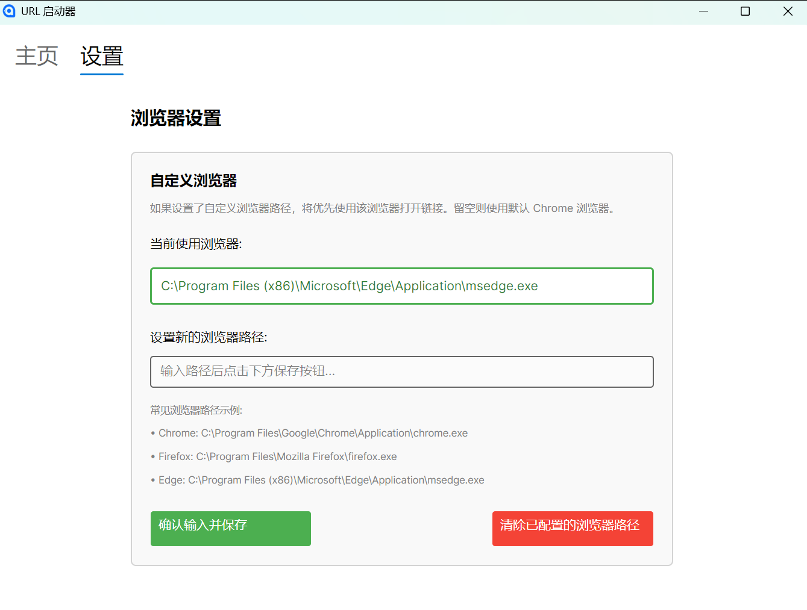
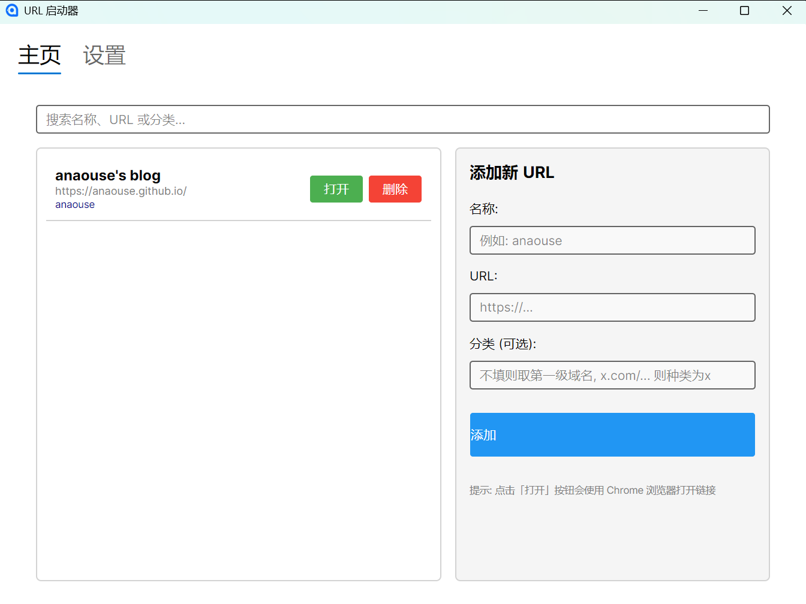

# UrlLauncher

这是一个基于dotnet avalonia模板开发的用于管理个人信息源的项目,目的是避免打开社交媒体漫无目的地滑动屏幕.这个项目确保我从互联网中获取信息的同时避免陷入互联网当中.

**English Version:** [README-en.md](./README-en.md)

## 基本使用方法

这里介绍基本使用方法

我只build了Windows的x64版本,下载好后解压得到一个文件夹,里面有各种dotnet的依赖项,运行UrlLauncher.exe后就会跳出一个弹窗

### 设置浏览器路径

如果不设置的话会尝试运行`chrome https://...`来打开网页,如果安装有chrome的话一般是可行的

如果不行或者你想使用其他浏览器那么就需要设置浏览器路径,下方也有常见的浏览器安装的路径,这里我使用Edge作为例子:

点击设置,把`C:\Program Files (x86)\Microsoft\Edge\Application\msedge.exe`填入输入框后点击下方确认输入并保存,可以发现当前使用的浏览器发生了变化,点击清除已配置的浏览器路径就会回复默认,尝试使用chrome打开,如果需要改变当然也可以重新填写然后确认

### 添加信息源

在主页,举个例子,名称填入`anaouse's blog`,URL填入`https://anaouse.github.io/`,然后分类可以不填写,它会截取URL当中第一个`.`之前的内容作为分类,这里的例子就是截取`anaouse`作为分类,如果你填写的是一个X用户的URL,如`https://x.com/...`那么就会截取`x`作为分类.点击添加,左侧就出现了对应的tab,你可以打开或者删除

## 我的使用流程

推荐算法与系统之后的时代会回归于信息源时代,就像是RSS的使用一样,但是因为各个平台把创作者和用户圈在平台的网站内,对于我这种个体用户只好做出妥协,在不同的平台观看自己喜欢的创作者的内容.

我的使用方式是每周会打开这个软件然后浏览各个信息源过去一周发的东西,至于信息源选取的标准引人而异,我的标准是至少这个用户还是活跃的以及不会发布或者转发太多信息,以及说的话我感兴趣.

如何发现新的信息源?

第一,主动搜索一下自己感兴趣的东西然后根据回答选择自己感兴趣的博主

第二,一些平台(比如X)会在主页推荐相似的博主,可以通过这个方式选择

第三,根据博主讲的内容当中提到的其他人可以主动搜索看看

这样子,我基本不会在平时因为漫无目的或者打发时间而浏览社交媒体

当然也许浏览器标签就可以实现这样的功能,但是这算是我学习C#的一个练手项目,而且我还是喜欢这种一个软件做一件事的理念,因为这样很分明地知道需要做什么以及可以做什么

